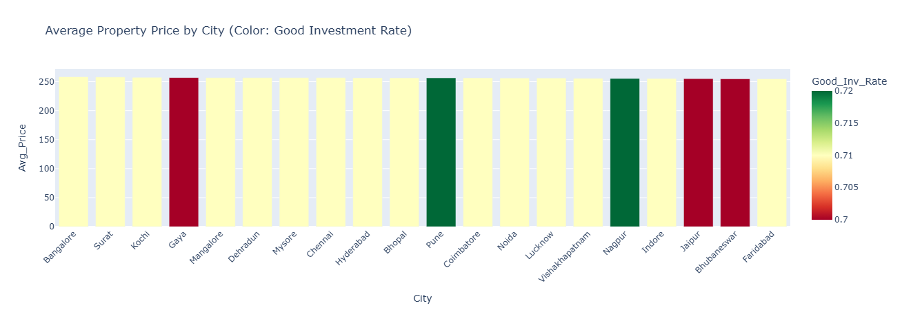
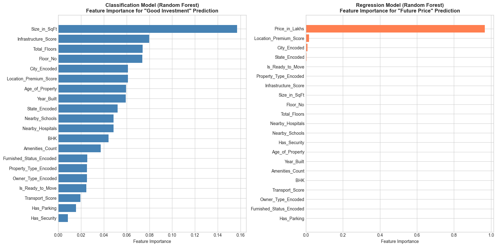
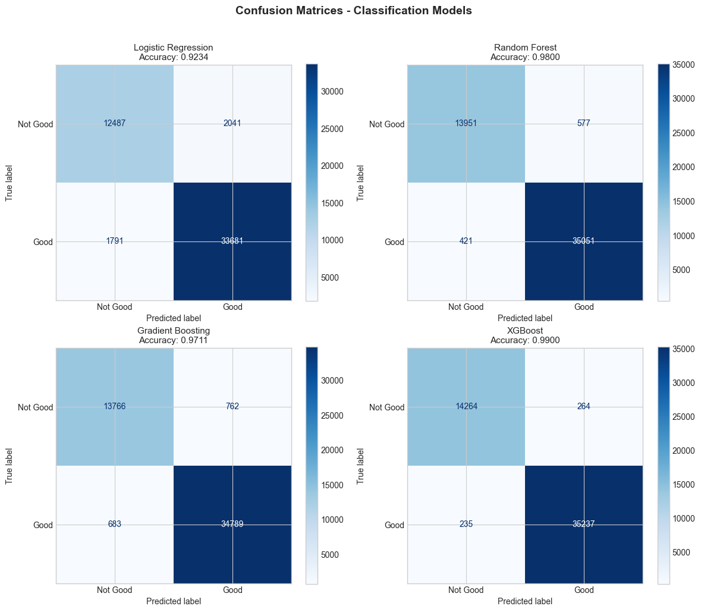
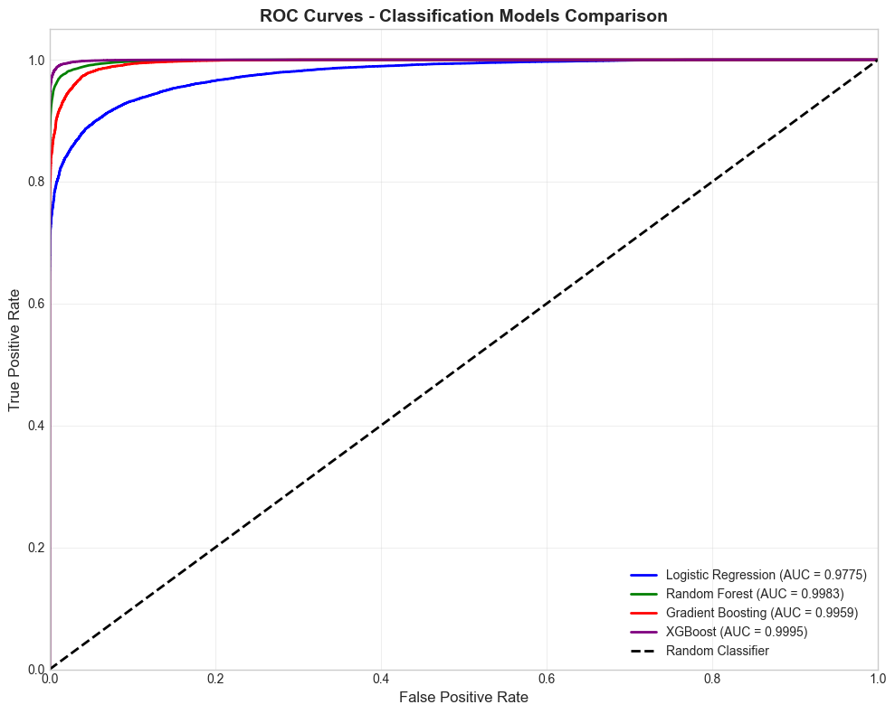
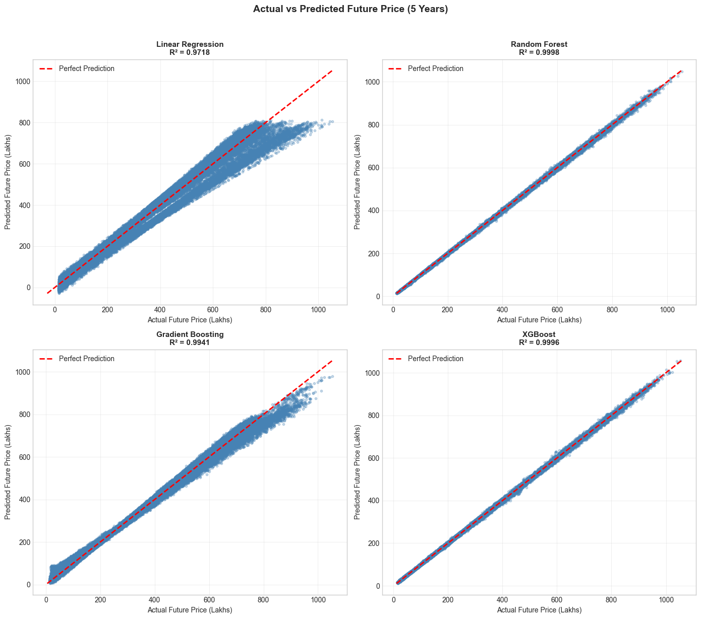
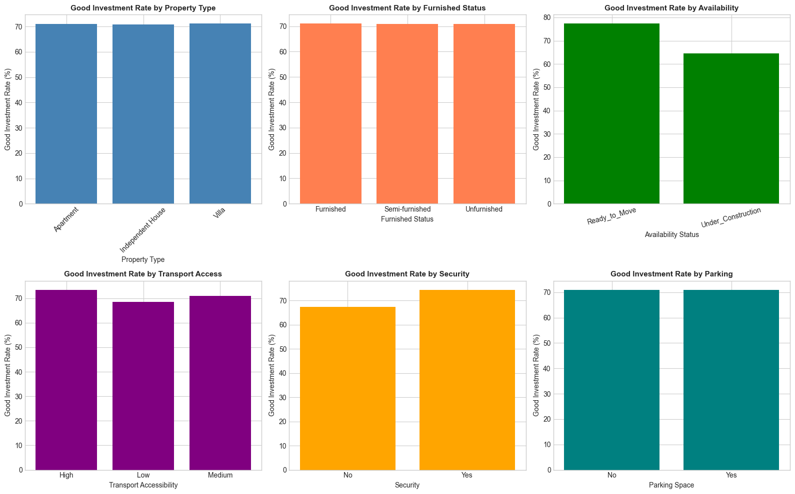
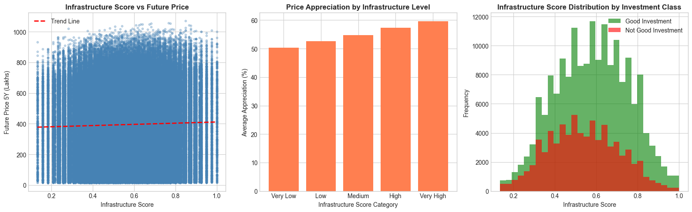

# 🏠 Real Estate Investment Advisor

<div align="center">


**An AI-powered real estate investment analysis platform that predicts property profitability and future value using Machine Learning**

[Features](#-features) • [Demo](#-demo) • [Installation](#-installation) • [Usage](#-usage) • [Model Details](#-model-details) • [API](#-api-endpoints)

</div>

---

## 📋 Table of Contents

- [Overview](#-overview)
- [Features](#-features)
- [Demo Screenshots](#-demo-screenshots)
- [Tech Stack](#-tech-stack)
- [Project Structure](#-project-structure)
- [Installation](#-installation)
- [Usage](#-usage)
- [Dataset](#-dataset)
- [Model Details](#-model-details)
- [Exploratory Data Analysis](#-exploratory-data-analysis)
- [API Endpoints](#-api-endpoints)
- [MLflow Tracking](#-mlflow-tracking)
- [Contributing](#-contributing)
- [License](#-license)

---

## 🎯 Overview

The **Real Estate Investment Advisor** is a comprehensive machine learning solution designed to help investors make data-driven decisions in the Indian real estate market. The platform analyzes property characteristics and market trends to provide:

1. **Investment Classification**: Determines whether a property is a "Good Investment" or "Not Recommended"
2. **Price Prediction**: Estimates the property's value after 5 years
3. **Price Validation**: Compares your price against market benchmarks to identify overpriced/underpriced properties

### Key Highlights

- 🤖 **Dual ML Models**: XGBoost Classification + Regression
- 📊 **250,000+ Properties**: Trained on comprehensive Indian housing data
- 🎨 **Modern UI**: Glassmorphism design with Tailwind CSS
- 📈 **Real-time Analytics**: Interactive charts and visualizations
- 🔍 **Smart Validation**: Rule-based sanity checks for realistic predictions
- 📝 **MLflow Integration**: Complete experiment tracking and model versioning

---

## ✨ Features

### 🔮 Prediction Engine
- Binary classification for investment viability
- 5-year price forecasting with appreciation calculation
- Confidence scores and probability distributions
- Feature importance analysis

### 🛡️ Smart Validation
- Price-per-sqft analysis against city benchmarks
- Detection of overpriced properties (>1.5x market rate)
- Size-BHK mismatch warnings
- Tiny property alerts

### 📊 Analytics Dashboard
- City-wise price comparison
- Property type distribution
- Price trend analysis
- ML model performance metrics

### 🎨 Modern Interface
- Responsive design for all devices
- Dark theme with amber/teal accents
- Smooth animations (AOS library)
- Interactive ApexCharts visualizations

---

## 📸 Demo Screenshots

### Home Page
The landing page features a modern hero section with gradient effects and animated elements.


### Prediction Form
An intuitive multi-step form to input property details.


### Results - Good Investment
When a property is classified as a good investment with detailed analysis.


### Results - Not Recommended
Properties flagged with warnings and alerts for overpricing or other concerns.


### Market Insights
Comprehensive analytics dashboard with real-time market data.


---

## 🛠️ Tech Stack

### Backend
| Technology | Purpose |
|------------|---------|
| **Python 3.9+** | Core programming language |
| **Flask 2.3+** | Web framework |
| **XGBoost 1.7+** | ML models (Classification & Regression) |
| **Scikit-learn 1.2+** | Preprocessing & metrics |
| **MLflow 2.3+** | Experiment tracking |
| **Pandas/NumPy** | Data processing |

### Frontend
| Technology | Purpose |
|------------|---------|
| **Tailwind CSS** | Utility-first styling |
| **ApexCharts** | Interactive charts |
| **Chart.js** | Additional visualizations |
| **AOS** | Scroll animations |
| **Font Awesome** | Icons |

### Data Visualization (Notebook)
| Technology | Purpose |
|------------|---------|
| **Matplotlib** | Static plots |
| **Seaborn** | Statistical visualizations |
| **Plotly** | Interactive charts |

---

## 📁 Project Structure

```
PROPERTY/
├── 📄 app.py                          # Flask application
├── 📓 Real_Estate_Investment_Advisor.ipynb  # ML training notebook
├── 📊 india_housing_prices.csv        # Dataset (250K+ records)
├── 📋 requirements.txt                # Python dependencies
├── 📖 README.md                       # Project documentation
├── 📜 LICENSE                         # MIT License
│
├── 📂 models/                         # Trained models & artifacts
│   ├── classification_model.joblib   # XGBoost classifier
│   ├── regression_model.joblib       # XGBoost regressor
│   ├── scaler.joblib                 # StandardScaler
│   ├── label_encoders.pkl            # Categorical encoders
│   ├── clf_feature_names.pkl         # Classification features (20)
│   ├── reg_feature_names.pkl         # Regression features (21)
│   ├── dropdown_values.pkl           # Form dropdown options
│   ├── city_state_map.pkl            # City-State mapping
│   ├── city_growth_rates.pkl         # Growth rate data
│   └── sample_data.csv               # Sample for insights
│
├── 📂 templates/                      # Jinja2 HTML templates
│   ├── base.html                     # Base template with nav/footer
│   ├── index.html                    # Home page
│   ├── predict.html                  # Prediction form
│   ├── result.html                   # Results display
│   ├── insights.html                 # Analytics dashboard
│   └── error.html                    # Error page
│
├── 📂 Charts/                         # EDA visualizations
│   ├── Correalation_heatmap_of_Numerical_Features.png
│   ├── Average_Property_Price_By_City.png
│   ├── Feature_importance.png
│   ├── Confusion_Matrices_of_Classification_Models.png
│   ├── ROC_curves_of_Classification_Models.png
│   ├── Actual_vs_Future_Price.png
│   ├── Price_Trends.png
│   ├── Impact_of_Various_Factors.png
│   └── Infra_vs_Resale.png
│
├── 📂 Flask app Images/               # App screenshots
│   ├── Home_01.png, Home_02.png, Home_03.png
│   ├── Prediction.png
│   ├── Good_prediction_01.png, Good_pridiction_02.png
│   ├── Bad_prediction_01.png, Bad_prediction_02.png
│   └── Insights_01.png, Insights_02.png, Insights_03.png
│
└── 📂 mlruns/                         # MLflow experiment logs
```

---

## 🚀 Installation

### Prerequisites
- Python 3.9 or higher
- pip package manager
- Git (optional)

### Step 1: Clone the Repository
```bash
git clone https://github.com/yourusername/real-estate-investment-advisor.git
cd real-estate-investment-advisor
```

### Step 2: Create Virtual Environment (Recommended)
```bash
# Windows
python -m venv venv
venv\Scripts\activate

# macOS/Linux
python3 -m venv venv
source venv/bin/activate
```

### Step 3: Install Dependencies
```bash
pip install -r requirements.txt
```

### Step 4: Train Models (First Time Only)
Open and run the Jupyter notebook to train models:
```bash
jupyter notebook Real_Estate_Investment_Advisor.ipynb
```
Run all cells to:
- Preprocess the dataset
- Train classification and regression models
- Save models to the `models/` directory
- Log experiments to MLflow

### Step 5: Run the Flask Application
```bash
python app.py
```

### Step 6: Open in Browser
Navigate to: **http://localhost:5000**

---

## 📖 Usage

### Making a Prediction

1. **Navigate** to the Predict page
2. **Fill in** property details:
   - Location (State & City)
   - Property Type (Apartment/Villa/Independent House)
   - BHK Configuration
   - Size (Square Feet)
   - Price (in Lakhs)
   - Age, Floor, Amenities, etc.
3. **Submit** the form
4. **View Results**:
   - Investment Classification (Good/Not Recommended)
   - Confidence Score
   - 5-Year Price Prediction
   - Price Analysis & Alerts
   - Feature Importance

### Understanding Results

| Indicator | Meaning |
|-----------|---------|
| 🟢 Good Investment | Property meets investment criteria |
| 🔴 Not Recommended | Consider negotiating or other properties |
| ⚠️ Overpriced Alert | Price/sqft exceeds market benchmark |
| ✅ Good Value | Price is below market average |

---

## 📊 Dataset

### Overview
The model is trained on **india_housing_prices.csv** containing **250,002 property records** across India.

### Features (23 Columns)

| Category | Features |
|----------|----------|
| **Location** | State, City |
| **Property** | Property_Type, BHK, Size_in_SqFt, Floor_No, Total_Floors |
| **Pricing** | Price_in_Lakhs, Price_per_SqFt |
| **Condition** | Furnished_Status, Property_Age, Year_Built |
| **Amenities** | Parking, Gym, Swimming_Pool, Garden, Security |
| **Surroundings** | Nearby_Schools, Nearby_Hospitals, Public_Transport_Access |
| **Transaction** | Owner_Type, Availability_Status |
| **Future Value** | Resale_Value, Predicted_Growth_Rate |

### Target Variables

1. **Good_Investment** (Classification): Binary target derived from:
   - Predicted Growth Rate > 5%
   - Resale Value > Current Price
   
2. **Future_Price_5Y** (Regression): Estimated price after 5 years based on growth rate

---

## 🤖 Model Details

### Classification Model (Investment Viability)

**Algorithm**: XGBoost Classifier

**Features Used** (20 features - excludes Price):
- Size_in_SqFt, BHK, Property_Age, Floor_No, Total_Floors
- Nearby_Schools, Nearby_Hospitals
- Parking, Gym, Swimming_Pool, Garden, Security
- Public_Transport_Access
- Encoded: State, City, Property_Type, Furnished_Status, Owner_Type, Availability_Status

**Why Price is Excluded**: Including price would cause data leakage since `Good_Investment` is derived from price-related metrics.

**Hyperparameters**:
```python
XGBClassifier(
    n_estimators=200,
    max_depth=6,
    learning_rate=0.1,
    subsample=0.8,
    colsample_bytree=0.8,
    random_state=42
)
```

### Regression Model (Price Prediction)

**Algorithm**: XGBoost Regressor

**Features Used** (21 features - includes Price):
- All classification features PLUS Price_in_Lakhs

**Hyperparameters**:
```python
XGBRegressor(
    n_estimators=200,
    max_depth=6,
    learning_rate=0.1,
    subsample=0.8,
    colsample_bytree=0.8,
    random_state=42
)
```

### Rule-Based Validation

In addition to ML predictions, the system applies sanity checks:

```python
# City-wise price benchmarks (₹/sqft)
city_benchmarks = {
    'Mumbai': 20000, 'Delhi': 15000, 'Bangalore': 12000,
    'Chennai': 10000, 'Hyderabad': 8000, 'Pune': 9000,
    'Kolkata': 7000, 'Ahmedabad': 6000, ...
}

# Validation rules
- Overpriced: price_ratio > 1.5x market average
- Extremely Overpriced: price_ratio > 2.5x
- Tiny Property: < 200 sqft
- Size Mismatch: BHK vs expected minimum size
```

---

## 📈 Exploratory Data Analysis

### Correlation Heatmap
Understanding relationships between numerical features.


### Average Property Price by City
Price distribution across major Indian cities.



### Feature Importance
Most influential factors in predictions.



### Model Performance - Confusion Matrix
Classification model accuracy visualization.



### ROC Curves
Model discrimination ability.



### Actual vs Predicted Prices
Regression model accuracy.



### Price Trends Analysis
Historical and predicted price movements.


### Infrastructure Impact
Effect of amenities on property value.



### Infrastructure vs Resale Value
Correlation between amenities and resale potential.



---

## 🔌 API Endpoints

| Method | Endpoint | Description |
|--------|----------|-------------|
| GET | `/` | Home page |
| GET | `/predict` | Prediction form |
| POST | `/predict` | Submit prediction |
| GET | `/insights` | Analytics dashboard |
| GET | `/api/cities/<state>` | Get cities for a state |

### Example API Response (Cities)
```json
GET /api/cities/Maharashtra

{
  "cities": ["Mumbai", "Pune", "Nagpur", "Nashik", "Thane"]
}
```

---

## 📊 MLflow Tracking

All experiments are logged to MLflow for reproducibility.

### View Experiments
```bash
mlflow ui
```
Navigate to: **http://localhost:5000**

### Logged Metrics
- Classification: Accuracy, Precision, Recall, F1-Score, ROC-AUC
- Regression: MSE, RMSE, MAE, R² Score

### Logged Artifacts
- Trained models
- Feature importance plots
- Confusion matrices
- Hyperparameters

---

## 🤝 Contributing

Contributions are welcome! Please follow these steps:

1. **Fork** the repository
2. **Create** a feature branch (`git checkout -b feature/AmazingFeature`)
3. **Commit** changes (`git commit -m 'Add AmazingFeature'`)
4. **Push** to branch (`git push origin feature/AmazingFeature`)
5. **Open** a Pull Request

### Development Guidelines
- Follow PEP 8 style guide
- Add docstrings to functions
- Update README for new features
- Write unit tests for critical functions

---

## 📄 License

This project is licensed under the **MIT License** - see the [LICENSE](LICENSE) file for details.

---

## 👨‍💻 Author

**Tarang Kishor**

- GitHub: [@tarangkishor](https://github.com/tarangkishor)
- LinkedIn: [Tarang Kishor](https://linkedin.com/in/tarangkishor)

---

## 🙏 Acknowledgments

- Dataset inspired by Indian real estate market data
- UI design inspired by modern glassmorphism trends
- Thanks to the open-source community for amazing tools

---

<div align="center">

**⭐ Star this repository if you found it helpful!**

Made with ❤️ for real estate investors

</div>
